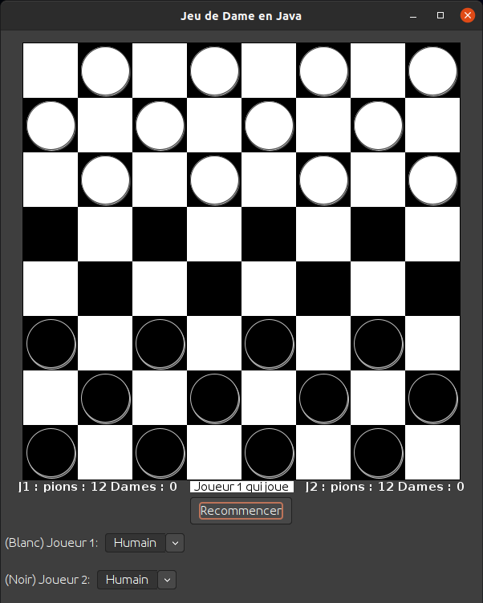

# Jeu de Dame en Java

## Déscription
Un jeu de dames avec une interface graphique implémentée en Java Swing. Le programme prend en charge un simple joueur (un humain) Vs un autre joueur en jouant tour par tour.

## Compiler et exécuter
### Manuel
1. Dans un terminal, mettez vous dans le dossier du projet courrant
2. Compilez avec `javac -d out ui/*.java model/*.java logic/*.java`
3. Exécutez avec `java -cp ./out ui.Main`

## Features
### Interface graphique
Le programme de jeu de dames est livré complet avec tous les composants de l'interface utilisateur graphique qui s'adaptent à la taille de la fenêtre. Il s'agit d'une interface utilisateur conviviale qui comporte des options permettant de changer le type de joueur pour les joueurs 1 et 2, et de relancer la partie. En outre, il fournit une interface utilisateur de damier pour montrer l'état actuel du jeu.

